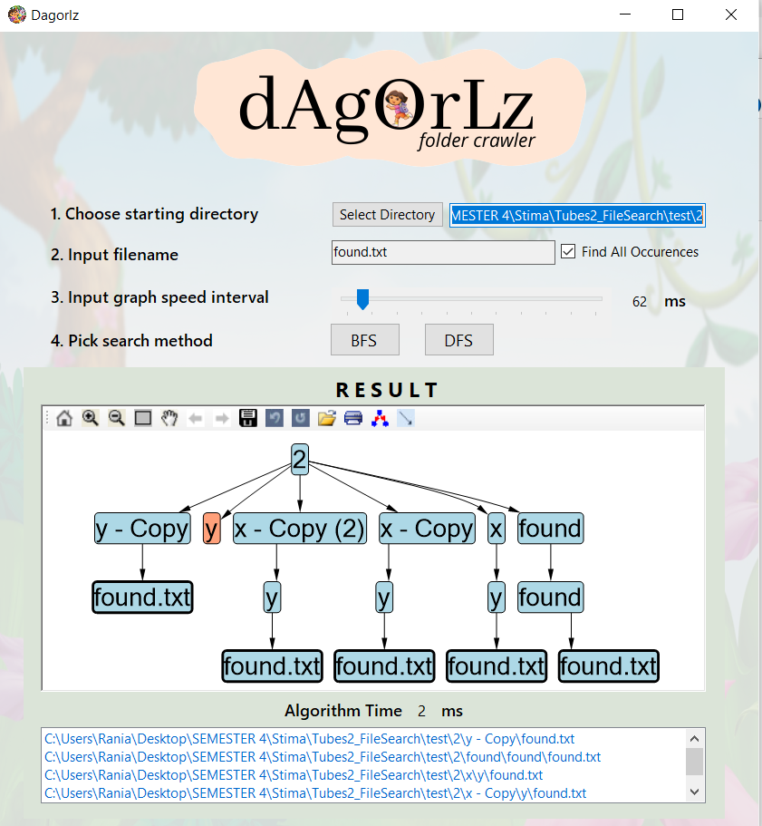

# Dagorlz Folder Crawler
> GUI-based folder crawler to find a certain file

## Introduction
Dagorlz folder crawler is a lalalala

## Creator
| |
| ---  |
|Grace Claudia  |	
|Sarah Azka Arief |	
|Rania Dwi Fadhilah |

## Overview

Feature :

## How to Use

### Dependencies
- [Visual Studio](https://visualstudio.microsoft.com/)
- [MSAgl](https://github.com/microsoft/automatic-graph-layout)
- C#
- .NET
### Installation
```
git clone https://github.com/graceclaudia19/Tubes2_FileSearch.git
```

### Program Execution
* Run Program : navigate to ```./bin``` and run ```dagorlz.exe```
* Compile Program : open ```dagorlz.sln``` file in ```./src/dagorlz/``` with Visual Studio

